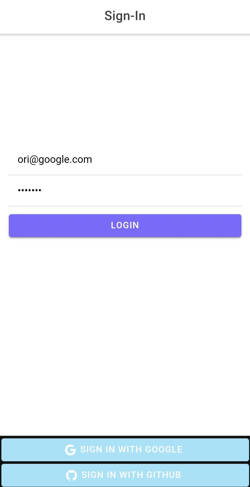
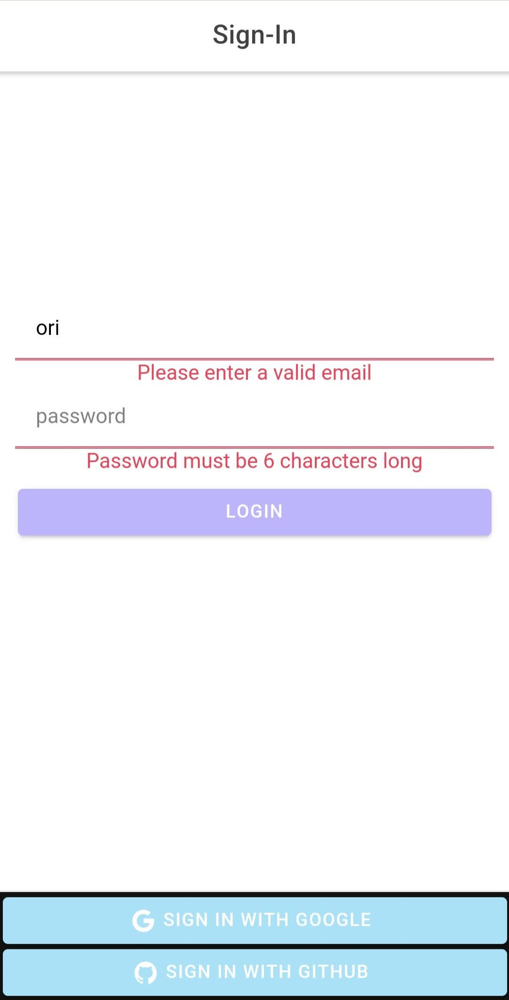
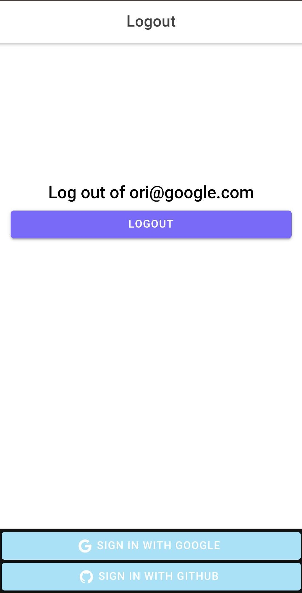

# Ionic Angular App

**[CHECK IT OUT!](https://main--creative-monstera-a891f1.netlify.app/menu/sign-in)**

### Aims

Learned to use Angular, Ionic and StencilJS as part of this project

## Sign-In

The sign-in username and password inputs use a `FormBuilder`, `FormGroup`, `Validators` to display errors to the user when the input does not meet the requirement. Entering a valid email and password updates the `user-service` and adds a current user that is available on any page that needs it. The user is automatically routed to the `master-list` upon submission.

Once a user is logged in, going back to the sign-up page only enables them to log out

 |

<!--  |  |  -->

## Menu

An empty path automatically redirects to the Menu - all routs are controlled in the `menu-routing-modules.ts` through the component's children. `Menu.page.html` enables a menu that can slide open or close

```html
<ion-split-pane contentId="content">
  <ion-menu contentId="content">
    <ion-menu-toggle auto-hide="false">
      <ion-router-outlet
        id="content"
      ></ion-router-outlet></ion-menu-toggle></ion-menu
></ion-split-pane>
```

## Master

The master list includes a menu button that toggles the menu open and highlights the current page.

The master list loads a list of Reddit posts on init by calling functions provided in the `master.service.ts` objects subscribed from there are already refined to include just the necessary data instead of the big JSON that is sent. A loader is also initiated with the help of ionic’s `LoadingController` while the data arrives.

The data is displayed through an `ion-list` where each `ion-item` is clickable and included a small preview image a title, the name of the author, and a badge for Reddit’s up-vote ratio for that given post.

Clicking an item routes to the details page using the post’s name as an ID eg. `/t3_v11g7h`

## Detail

The detail page on initiation calls the `master.service.ts` and gets a new individual Reddit call for the particular post. The display shows a back button to the master list. A card displays the author’s name, upVote ratio, and a larger image (if an image is not available a dummy image appears instead). At the bottom of the page, the user is able to click on a button that links to the post on Reddit.

## Chat

The chat page is styled like a chat window with the history on top and a text area and send button at the bottom. The first message is a hard-coded dummy that displays on the opposite side for visual effect. When a user sends a message their name (taken dynamically from `user.service.ts`) appears along with the current time.

## The Custom Component

Created as a separate app on **StencilJS** and published on **npm**, the stencil page displays the same information as the master list only on different cards. The app is installed separately

For more information on how to install this custom component on any app visit:

[npm!](https://www.npmjs.com/package/initial-components-ori)

[GitHub!](https://github.com/AltaraceO/stencil_components)

## Thanks
